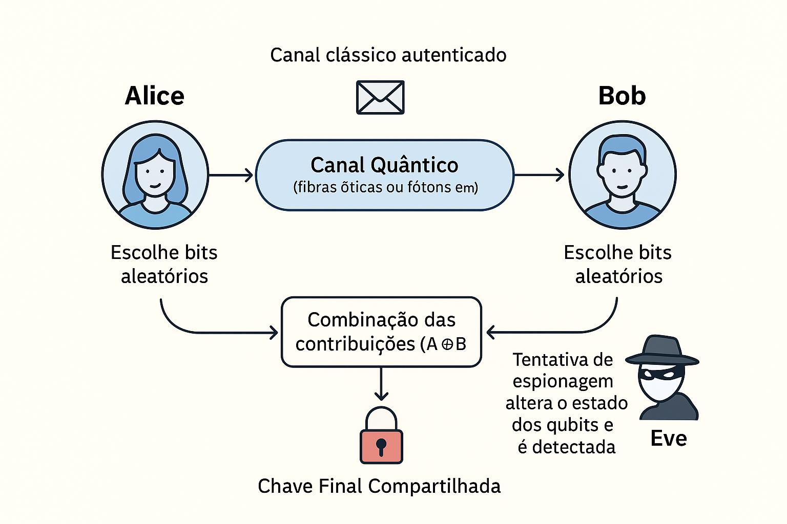
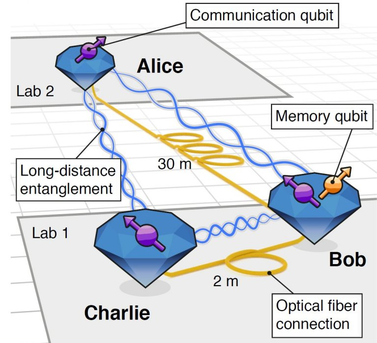

# Comunicação Quântica
A **comunicação quântica** é uma tecnologia que usa princípios da mecânica quântica para **transmitir informações de forma segura e eficiente**. Diferente da comunicação clássica (como a internet atual, baseada em $0$ ou $1$), ela explora partículas quânticas, como fótons, para criar sistemas impossíveis de hackear sem ser detectado. Isso é possível graças a leis da física quântica, como a superposição e o emaranhamento.
Imagine enviar uma mensagem secreta que, se alguem tentar espiar, a mensagem se "autodestrói" ou avisa os envolvidos. Isso soa como ficção científica, mas é real e já está sendo testado em redes quânticas pelo mundo.

---

## Princípios Básicos da Mecânica Quântica
Para entendermos a comunicação quântica, precisamos de alguns conceitos fundamentais da física quântica. 
- Qubit: O "bit quântico". Enquanto um bit classico é $0$ ou $1$, um qubit pode estar em superposição: uma mistura de $0$ e $1$ ao mesmo tempo. Matematicamente, um qubit é representado por um vetor em um espaço de Hilbert, como $|\psi\rangle = \alpha|0\rangle + \beta|1\rangle$, onde $|\alpha^2| + |\beta^2| = 1$.

- Superposição: Uma partícula quântica pode existir em múltiplos estados até ser medida. É como uma moeda girando no ar - ela não é cara ou coroa até cair.

- Emaranhamento: Duas partículas ligadas de forma que o estado de uma afeta instantaneamente a outra mesmo a distâncias enormes. Einstein chamava isso de "ação fantasmagórica à distância".

- Medição: Ao medir um sistema quântico ele "colapsa" para um estado classico. Isso é chave para segurança quântica, pois qualquer espionagem perturba o sistema. 

Esses princípios permitem comunicações seguras, pois qualquer interferência é detectável.

---

## O que é Comunicação Quântica?
Comunicação Quântica envolve a transmissão de informações usando estados quânticos. Um exemplo clássico é a **Distribuição de Chaves Quânticas**

### Distribuição Quântica de Chaves (QKD)

A **QKD** (Quantum Key Distribution) é a tecnologia mais consolidada da comunicação quântica.  
Permite que duas partes, **Alice e Bob**, compartilhem uma chave criptográfica com segurança garantida pelas leis da física.

Diferente da criptografia clássica (como RSA, baseada em matemática difícil de resolver), a quântica usa física: se um espião (Eve) tentar interceptar, ele altera os qubits, alertando Alice e Bob.

Algumas futuras aplicações da QKD são:
- Redes quânticas seguras para bancos e governos.
- Internet quântica futura, conectando computadores quânticos.
- teleportação quântica: Transferir estados quânticos sem mover matéria física.


Desafios: Distâncias limitadas (devido à perda de sinal em fibras óticas) e necessidade de repetidores quânticos.

---

### Protocolo BB84
Um dos protocolos mais famosos é o BB84, criado por Charles Bennett e Gilles Brassard em 1984. Ele permite que Alice e Bob compartilhem uma chave secreta usando fótons polarizados.
<!-- Adicionar foto? -->

Exemplo:
1. Alice gera bits aleatórios e os codifica em qubits (fótons) usando duas bases: retilínea (horizontal/vertical) ou diagonal.

2. Envia para Bob.

3. Eles comparam bases publicamente (sem revelar os bits) e descartam as medidas em que as bases não coicidem.

5. Os bits coincidentes formam a chave. Se houver erros acima do normal, pode haver espião.

Isso é seguro porque medir na base errada randomiza o resultado, e espionagem causa erros detectáveis.
<!--Diagrama de amostra-->

---

## Teletransporte Quântico
O teletransporte quântico permite transmitir **estados quânticos** de uma partícula a outra usando **emaranhamento**.  
Ele não transporta matéria, apenas informação — sendo essencial para redes e comunicações quânticas futuras.

---

## Internet Quântica
A **Internet Quântica** busca conectar computadores e sensores quânticos em uma rede global.  
Usa fótons como portadores de qubits e combina QKD e teletransporte quântico para criar comunicações invioláveis.

**Projetos em destaque:**
- Satélite **Micius (China)**
- **DARPA Quantum Internet (EUA)**
- **Quantum Flagship (Europa)**



---

## Desafios e Avanços
- **Perda de fótons** e **decoerência** limitam a distância das transmissões.  
- **Repetidores quânticos** e **memórias quânticas** estão sendo desenvolvidos para expandir o alcance.  
- **Satélites quânticos** eliminam perdas atmosféricas e ampliam a comunicação global.

---

## Exemplo
```python

import numpy as np

# --------------- Funções básicas ---------------

def generate_bits(n):
    """Gera n bits aleatórios (0 ou 1)."""
    return np.random.randint(0, 2, size=n)

def choose_bases(n):
    """Gera n bases aleatórias: 0 = retilínea (+), 1 = diagonal (x)."""
    return np.random.randint(0, 2, size=n)

def bob_measure(sent_bits, sent_bases, bob_bases):
    """
    Bob mede os qubits:
    - Se a base de Bob = base usada no envio, ele lê o bit correto.
    - Se a base é diferente, o resultado é aleatório (0 ou 1).
    """
    n = len(sent_bits)
    random_bits = np.random.randint(0, 2, size=n)
    same_basis = (sent_bases == bob_bases)
    measured = np.where(same_basis, sent_bits, random_bits)
    return measured

def sifting(alice_bases, bob_bases, alice_bits, bob_bits):
    """
    Mantém apenas as posições onde as bases coincidem.
    Retorna a chave de Alice e Bob após sifting.
    """
    mask = (alice_bases == bob_bases)
    return alice_bits[mask], bob_bits[mask], mask

# --------------- Simulação BB84 simples ---------------

def run_bb84_simple(n_qubits=50, seed=42):
    np.random.seed(seed)

    # 1. Alice gera bits e bases
    alice_bits = generate_bits(n_qubits)
    alice_bases = choose_bases(n_qubits)

    # (Aqui estamos ignorando Eve e ruídos)
    sent_bits = alice_bits
    sent_bases = alice_bases

    # 2. Bob escolhe bases e mede
    bob_bases = choose_bases(n_qubits)
    bob_bits = bob_measure(sent_bits, sent_bases, bob_bases)

    # 3. Sifting: comparam bases publicamente
    alice_key, bob_key, mask = sifting(alice_bases, bob_bases, alice_bits, bob_bits)

    # 4. Verificamos se as chaves coincidem (deveriam, se não há ruído/Eve)
    equal = np.array_equal(alice_key, bob_key)

    print("Bits de Alice:    ", ''.join(map(str, alice_bits)))
    print("Bases de Alice:   ", ''.join('+' if b==0 else 'x' for b in alice_bases))
    print("Bases de Bob:     ", ''.join('+' if b==0 else 'x' for b in bob_bases))
    print("Máscara (iguais): ", ''.join('1' if m else '0' for m in mask))
    print()
    print("Chave de Alice apos sifting:", ''.join(map(str, alice_key)))
    print("Chave de Bob   apos sifting:", ''.join(map(str, bob_key)))
    print("Chaves iguais?", equal)

if __name__ == "__main__":
    run_bb84_simple()

```

---

## Conclusão

A comunicação quântica representa a próxima revolução tecnológica.  
Com base nas leis da física, ela promete uma **internet verdadeiramente segura** e um novo paradigma de troca de informações.

> “A comunicação quântica é a linguagem do futuro — escrita não em bits, mas nas leis fundamentais do universo.”

---

[⬅️ Voltar à Infraestrutura Quântica](infraestrutura.md) | [🏠 Voltar à Página Inicial](index.md)